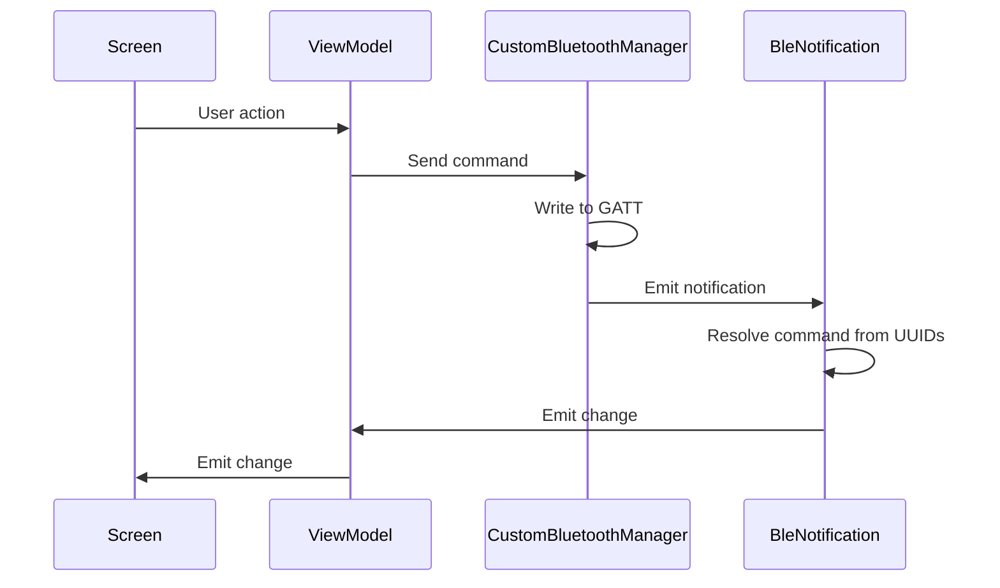

# Raspberry Pi BLE Commissioning

An Android application paired with a Python GATT server for commissioning a Raspberry Pi over BLE. The app connects to the Pi to read its current network information and configure Wi-Fi credentials, making it possible to set up headless devices without a monitor or keyboard.

## Demo (in progress)

<video src="https://github.com/user-attachments/assets/f0a714da-4d5c-4af6-b9b5-a2651bfe333c"></video>

## Work in progress

**Device management**
- Reboot or shutdown the Pi remotely
- Read CPU temperature and memory usage
- Read the Pi model and OS version

**Network**
- Forget a saved Wi-Fi network
- Switch between saved networks

**Diagnostics**
- Ping a host and return the result
- Read system uptime
- Tail the last N lines of a log file

## Architecture


## Raspberry Pi

The GATT server is written in Python using `bluezero` and exposes three characteristics: the current IP address, the connected Wi-Fi network name, and a writable characteristic for sending Wi-Fi credentials.

### Prerequisites

```bash
sudo apt install libcairo2-dev -y
sudo apt install libgirepository1.0-dev -y
sudo apt install libdbus-1-dev -y
```

### Setup virtual environment

```bash
python3 -m venv ~/venv_bluetooth --system-site-packages
source ~/venv_bluetooth/bin/activate
pip install bluezero
```

### Running the server

```bash
source ~/venv_bluetooth/bin/activate
sudo python3 gatt_server.py
```

> `sudo` is required for `nmcli` to connect to Wi-Fi networks.

To exit the virtual environment, run `deactivate`.

### Auto-start on boot (systemd)

Create a service file:

```bash
sudo vim /etc/systemd/system/gatt_server.service
```

Paste the following, replacing `<user>` and `<path>` with your username and script directory:

```ini
[Unit]
Description=GATT server BLE
After=network.target bluetooth.target

[Service]
Type=simple
User=root
WorkingDirectory=<path>
ExecStart=/home/<user>/venv_bluetooth/bin/python3 <path>/gatt_server.py
Restart=on-failure

[Install]
WantedBy=multi-user.target
```

Enable and start the service:

```bash
sudo systemctl daemon-reload
sudo systemctl enable gatt_server.service
sudo systemctl start gatt_server.service
```

Verify it is running:

```bash
sudo systemctl status gatt_server.service
```

## Android

The app follows unidirectional data flow. The screen dispatches user actions to the ViewModel, which delegates BLE writes to a custom Bluetooth manager. Incoming notifications are resolved against known UUIDs and propagated back up to the UI as state updates.


