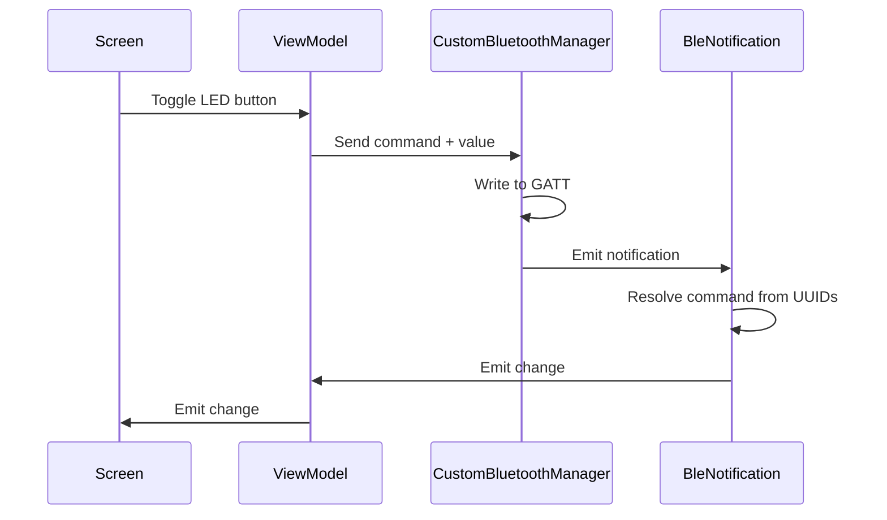

# Simple android ble GATT client
Python GATT server on Rasperry Pi and Android client to control a LED over BLE.

## Features
- Python GATT server running on a Raspberry Pi via `bluezero`
- Android app to scan, connect and send LED on/off commands via BLE
- systemd service for auto-start gatt server on boot

## Architecture


## Rapsberry Pi
### Prerequisites
```bash
sudo apt install libcairo2-dev -y
sudo apt install libgirepository1.0-dev -y
sudo apt install libdbus-1-dev -y

```

### Setup virtual environment
```bash
python3 -m venv ~/venv_bluetooth --system-site-packages
source ~/venv_bluetooth/bin/activate
pip install bluezero
```

### Running the server
```bash
source ~/venv_bluetooth/bin/activate
python3 gatt_server.py
```

> To exit the virtual environment, run `deactivate`

### Auto-start on boot (systemd)
Create a service file:
```bash
sudo vim /etc/systemd/system/gatt_server.service
```

Paster the following, **replacing `<user>` and `<path>` with your username and script directory**:

```ini
[Unit]
Description=GATT server BLE
# Wait for bluetooth and network before starting
After=network.target bluetooth.target

[Service]
Type=simple
User=<user>
WorkingDirectory=<path>
ExecStart=/home/charlie/venv_bluetooth/bin/python3 <path>/gatt_server.py
Restart=on-failure

[Install]
WantedBy=multi-user.target
```

Enable and start the service:
```bash
sudo systemctl daemon-reload
sudo systemctl enable gatt_server.service
sudo systemctl start gatt_server.service
```

Verify it's running:
```bash
sudo systemctl status gatt_server.service
```

## Android
The app follows an unidirectional data flow:

